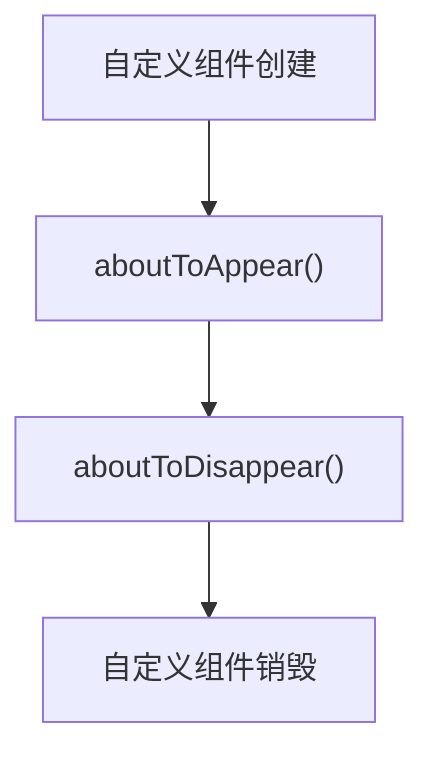

# ArkTs常用装饰器-自定义组件

## @Component
> 定义一个自定义的组件


### 定义组件的方式
```arkts title="myComponent"
@Component
export struct MyComponent {
    ...
    build() {
        ...
    }
}
```

### 使用组件的方式
```arkts title="main"
import { MyComponent } from './MyComponent'

@Entry
@Component
struct Main {
    build() {
        Column() {
            MyComponent()
        }
    }
}
```

### 自定义组件的生命周期

---

# ArkTs常用装饰器-组件内状态
## @State
> 定义一个组件内状态

### 定义状态的方式
```arkts title="myComponent.ets"
@Component
export struct MyComponent {
    @State state: string = 'state'
}
```