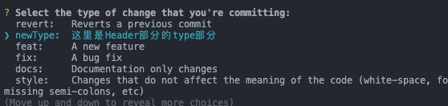
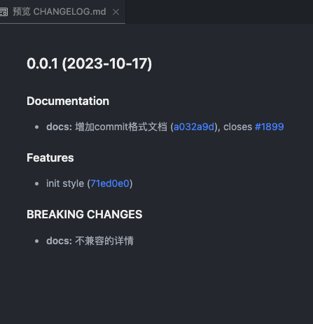

# 📝使用commitizen格式化提交规范

在团队的日常开发中最常使用的是**Angular提交规范**，但一般情况下都会使用vscode的插件或者第三方插件来格式化提交信息。这里我之前使用的是vscode插件：`git-commit-plugin`感觉不是很方便，后来便开始使用`commitizen`来格式化提交信息。

在这里放一个传送门: [commitizen的官网](http://commitizen.github.io/cz-cli)

## ⚙️ 安装
以下安装方式记录的是全局安装的方式
### 🖥️ install

**npm**
```shell
npm install -g commitizen
npm install -g cz-conventional-changelog
```

**yarn**
```shell
yarn global add commitizen
yarn global add cz-conventional-changelog
```

### 📃 配置文件

在项目的根目录下创建一个`.czrc`文件，文件内容填入：`{ "path": "cz-conventional-changelog" }`：
或者在根目录下执行一下命令创建

```shell
echo '{ "path": "cz-conventional-changelog" }' > ~/.czrc
```

**mac的文件目录**
打开`访达`，按`command+shift+g`, 前往`/用户/你的电脑名称`,下创建`.czrc`文件

**windows**
在`C:/Users/$USER`目录中创建`.czrc`文件

### ⏫ 提交

完成以上步骤之后，便可以使用`git cz`命令提交代码了。
在项目根目录下修改一些代码，然后使用 `git add .`, `git cz`命令，便会出现如下界面：


## 📖 使用说明

**Angular提交规范**的Commit message 分别为三个部分：Header，Body 和 Footer。
如下：

```shell
<type>(<scope>): <subject>
// 空一行
<body>
// 空一行
<footer>
---
```

1⃣️ 使用`git cz`命令后，会进入一个交互式的命令行，第一个阶段是选择Header里的type,上下选择完后按回车
```
? Select the type of change that you're committing: 
  ci:       Changes to our CI configuration files and scripts (example scopes: Travis, Circle, BrowserStack, SauceLabs) 
  chore:    Other changes that don't modify src or test files 
  revert:   Reverts a previous commit 
❯ feat:     A new feature 
  fix:      A bug fix 
  docs:     Documentation only changes 
  style:    Changes that do not affect the meaning of the code (white-space, formatting, missing semi-colons, etc) 
(Move up and down to reveal more choices)
```

2⃣️ 选择完type之后，会进入第二个阶段，选择`scope`，`scope`是可选的，用于说明本次提交的影响范围，如：Components，Directives，View等等不限。如果不想填写则可以按`enter`跳过。Header部分会成为: `<type>: <subject>`

```
? What is the scope of this change (e.g. component or file name): (press enter to skip) # 这里输入subject， 例如： Docs
```

3⃣️ 第三个阶段是填写`subject`，`subject`是必须的，用于说明提交的内容，如：添加了什么功能，修复了什么bug

```shell
? Write a short, imperative tense description of the change (max 88 chars):
 (0)  # 这里输入subject部分,例如：加commit格式文档
```

4⃣️ 第四个阶段是填写`body`，`body`是可选的，用于对提交内容的详细解释，如：为什么修改，影响范围等
```shell
? Provide a longer description of the change: (press enter to skip) # 这里输入body
```

5⃣️ 第五个阶段是填写`footer`，`footer`是可选的，用于列出一些备注内容，如：不兼容变动、关闭了哪些issue

**不兼容变动** *虽然这个地方不怎么用*: 
```shell
? Are there any breaking changes? (y/N) # 如果这里输入了y
# 则会在下面展示详细内容。
? A BREAKING CHANGE commit requires a body. Please enter a longer description of the 
commit itself:
 # 这里输入破坏性的主体
? Describe the breaking changes:
 # 这里输入变动的详情内容
```

**关闭了哪些issue**,*或者关闭的bug编号之类,bug链接等*:
```shell
? Does this change affect any open issues? # 这里输入yes后，展示如下：
? Add issue references (e.g. "fix #123", "re #123".):
 # 例如： fix #1899
```

输入完之后就可以`git push`了。gitcommit的例子如下：
```shell
Author: user_name <user_email>
Date:   当前的时间

    docs(docs): 增加commit格式文档
    
    BREAKING CHANGE: 不兼容的详情
    
    fix #1899
```

## 🔧 配置commitizen

### 🌈 配置自定义commit模板

找到`npm`或者`yarn`的global文件夹下的`conventional-commit-types`文件夹里的`index.json`文件

yarn的查看方式为：`yarn global dir`

npm的查看方式为：`npm root -g`

综合地址为：`全局global地址/node_modules/conventional-commit-types/index.json`然后打开

假设需要增加一个提交类型，文件如下：
```json title=conventional-commit-types/index.json
{
  "types": {
    "feat": {
      "description": "A new feature",
      "title": "Features"
    },
    "fix": {
      "description": "A bug fix",
      "title": "Bug Fixes"
    },
    "docs": {
      "description": "Documentation only changes",
      "title": "Documentation"
    },
    "style": {
      "description": "Changes that do not affect the meaning of the code (white-space, formatting, missing semi-colons, etc)",
      "title": "Styles"
    },
    "refactor": {
      "description": "A code change that neither fixes a bug nor adds a feature",
      "title": "Code Refactoring"
    },
    "perf": {
      "description": "A code change that improves performance",
      "title": "Performance Improvements"
    },
    "test": {
      "description": "Adding missing tests or correcting existing tests",
      "title": "Tests"
    },
    "build": {
      "description": "Changes that affect the build system or external dependencies (example scopes: gulp, broccoli, npm)",
      "title": "Builds"
    },
    "ci": {
      "description": "Changes to our CI configuration files and scripts (example scopes: Travis, Circle, BrowserStack, SauceLabs)",
      "title": "Continuous Integrations"
    },
    "chore": {
      "description": "Other changes that don't modify src or test files",
      "title": "Chores"
    },
    "revert": {
      "description": "Reverts a previous commit",
      "title": "Reverts"
    },
    "newType": {
      "description": "这里是Header部分的type部分",
      "title": "New Type Title"
    }
  }
}

```
修改之后保存，再次执行`git cz`时,便能看到刚才新增的了。


### 🌟 根据commit生成Change log

如果按照 **Angular提交规范** 提交代码，那么在提交代码时，会自动生成一个Change log，方便我们查看。生成的文档包括以下三个部分：
```
· New features
· Bug fixes
· Breaking changes.
```

首先需要安装一个包：[`conventional-changelog-cli`](https://github.com/conventional-changelog/conventional-changelog/tree/master/packages/conventional-changelog-cli)

```shell
# yarn
yarn global add conventional-changelog-cli
# npm
npm install -g conventional-changelog-cli
```

切换到你的项目中执行`conventional-changelog -p angular -i CHANGELOG.md -s`即可看到根目录下生成了CHANGELOG.md文件。如图所示：下面就是之前提交的commit



当然为了方便可以把此段命令添加到`package.json`的scripts中，这样每次执行`npm run changelog`即可生成Change log。