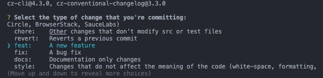

# 📝使用commitizen格式化提交规范

在团队的日常开发中最常使用的是**Angular提交规范**，但一般情况下都会使用vscode的插件或者第三方插件来格式化提交信息。这里我之前使用的是vscode插件：`git-commit-plugin`感觉不是很方便，后来便开始使用`commitizen`来格式化提交信息。

在这里放一个传送门: [commitizen的官网](http://commitizen.github.io/cz-cli)

## ⚙️ 安装
以下安装方式记录的是全局安装的方式
### 🖥️ install

**npm**
```shell
npm install -g commitizen
npm install -g cz-conventional-changelog
```

**yarn**
```shell
yarn global add commitizen
yarn global add cz-conventional-changelog
```

### 📃 配置文件

在项目的根目录下创建一个`.czrc`文件，文件内容填入：`{ "path": "cz-conventional-changelog" }`：
或者在根目录下执行一下命令创建

```shell
echo '{ "path": "cz-conventional-changelog" }' > ~/.czrc
```

**mac的文件目录**
打开`访达`，按`command+shift+g`, 前往`/用户/你的电脑名称`,下创建`.czrc`文件

**windows**
在`C:/Users/$USER`目录中创建`.czrc`文件

### ⏫ 提交

完成以上步骤之后，便可以使用`git cz`命令提交代码了。
在项目根目录下修改一些代码，然后使用 `git add .`, `git cz`命令，便会出现如下界面：




## 📖 使用说明

**Angular提交规范**的Commit message 分别为三个部分：Header，Body 和 Footer。
如下：

```shell
<type>(<scope>): <subject>
// 空一行
<body>
// 空一行
<footer>
---
```

1⃣️ 使用`git cz`命令后，会进入一个交互式的命令行，第一个阶段是选择Header里的type,上下选择完后按回车
```
? Select the type of change that you're committing: 
  ci:       Changes to our CI configuration files and scripts (example scopes: Travis, Circle, BrowserStack, SauceLabs) 
  chore:    Other changes that don't modify src or test files 
  revert:   Reverts a previous commit 
❯ feat:     A new feature 
  fix:      A bug fix 
  docs:     Documentation only changes 
  style:    Changes that do not affect the meaning of the code (white-space, formatting, missing semi-colons, etc) 
(Move up and down to reveal more choices)
```

2⃣️ 选择完type之后，会进入第二个阶段，选择`scope`，`scope`是可选的，用于说明本次提交的影响范围，如：Components，Directives，View等等不限。如果不想填写则可以按`enter`跳过。Header部分会成为: `<type>: <subject>`

```
? Select the type of change that you're committing: feat:     A new feature
? What is the scope of this change (e.g. component or file name): (press enter to skip) 
```

3⃣️ 

# Hello

This is my **first Docusaurus document**!
```

It is also possible to create your sidebar explicitly in `sidebars.js`:

``` title="zsh"
? Select the type of change that you're committing: 
  ci:       Changes to our CI configuration files and scripts (example scopes: Travis, Circle, BrowserStack, SauceLabs) 
  chore:    Other changes that don't modify src or test files 
  revert:   Reverts a previous commit 
❯ feat:     A new feature 
  fix:      A bug fix 
  docs:     Documentation only changes 
  style:    Changes that do not affect the meaning of the code (white-space, formatting, missing semi-colons, etc) 
(Move up and down to reveal more choices)
```
