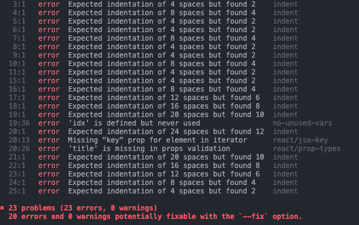
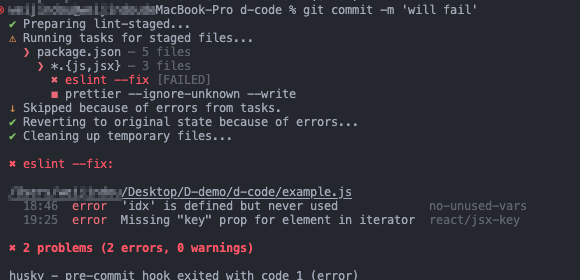

# 🌈eslint与prettire统一代码风格

`eslint`与`prettire`不论在哪个团队的项目都是要必须安装的。只要人数开发多了，代码风格不统一，就会造成很多问题。因此学会使用`eslint`与`prettire`是很有必要的。这两个工具分工不同，`eslint`是校验代码格式，`prettire`是格式化代码的工具。**一定要安装VsCode的Eslint插件**

> 在这里放一个传送门: [eslint的中文官网](https://eslint.nodejs.cn/)、[prettire的中文官网](https://www.prettier.cn/)

## 一、⚙️ 安装eslint
以下安装方式记录的是在在官网中的其中一种方式，如果想要更深入的功能，请移步官网查看
### 

```shell
# yarn
yarn add eslint -D
# npm
npm install --save-dev eslint
```


### 📃 配置文件
> 更多的规则介绍请移步官网查看：https://eslint.nodejs.cn/docs/latest/rules/

在项目的根目录下创建一个`.eslintrc.js`文件, 添加如下配置到该文件中。(下面的配置是这个博客的配置，可以根据自己的需要进行修改)

```js title=".eslintrc.js"
module.exports = {
    env: {
        browser: true,
        es2021: true,
    },
    rules: {
        'no-undef': 'off',
        eqeqeq: 'error',
        camelcase: 'error',
        curly: 'error',
        'max-depth': ['error', 4],
        'no-alert': 'error',
        'no-console': 'error',
        'no-else-return': 'error',
        'no-extra-semi': 'error',
        'no-var': 'warn',
        indent: ['error', 4],
    },
    extends: [
        'eslint:recommended',
    ],
    parserOptions: {
        ecmaVersion: 'latest',
        sourceType: 'module',
        ecmaFeatures: {
            jsx: true,
        },
    },
}

```

### 📋 自定义规则
如果按照自己想要的配置去一个个在rules进行调整，太麻烦了。可以通过`extends`来继承一些常用的规则配置。然后在通过rules里的部分配置去覆盖插件中配置的规则...

因为本项目使用的是`react18`作为项目框架，因此需要添加`react`相关的插件:[eslint-plugin-react](https://www.npmjs.com/package/eslint-plugin-react)。
如果是使用是`vue.js`可以使用[eslint-plugin-vue](https://eslint.vuejs.org/user-guide/)该插件来作为常用的继承配
#### 安装插件

```shell
# yarn
yarn add eslint-plugin-react -D
# 或者
yarn add eslint-plugin-vue -D

# npm
npm install --save-dev eslint-plugin-react
# 或者
npm install --save-dev eslint-plugin-vue
```

#### 配置继承
```js title=".eslintrc.js"
module.exports = {
    // 其他规则
    extends: [
        'plugin:react/recommended',
        'eslint:recommended',
        // 如果你使用的是vue.js的话
        // 'plugin:vue/vue3-recommended',
    ]
    // ...其他配置
}
```

如果你使用的是`react18`的话，在js文件中使用jsx的话eslint会抛出`'React' must be in scope when using JSX`的异常, 原因是`eslint-plugin-react`插件的校验存在问题。
解决办法：配置rules的两个规则来覆盖

```js title=".eslintrc.js"
module.exports = {
    rules: {
        // ...
        'react/jsx-uses-react': 'off',
        'react/react-in-jsx-scope': 'off',
        'react/prop-types': 'off',
    }
    extends: [
        'plugin:react/recommended',
        'eslint:recommended',
    ]
}
```


### 💫 运行elint校验代码

在项目的任意目录下创建个示例文件 例如：
```js title="test/example.js"
const FeatureList = [
  {
    title: 'Easy to Use',
  },
  {
    title: 'Focus on What Matters',
  },
  {
    title: 'Powered by React',
  },
];

export default function HomepageFeatures() {
  return (
    <section className={styles.features}>
      <div className="container">
        <div className="row">
          {FeatureList.map((props, idx) => (
            <div>{ props.title }</div>
          ))}
        </div>
      </div>
    </section>
  );
}
```
在项目根目录下运行`npx eslint test/example.js`即可

此时控制台会抛出eslint的结果




## 二、🎨 配置prettier

### 🔧 安装依赖prettier
```bash
# yarn
yarn add prettire -D
# npm
npm install --save-dev prettire
```

### 📃 配置格式化文件

在项目根目录下创建`.prettierrc.js`文件

> 如果要配置更多规则：[prettire的中文官网规则](https://www.prettier.cn/docs/options.html)

```js title=".prettierrc.js"
// prettier.config.js, .prettierrc.js, prettier.config.cjs, or .prettierrc.cjs
/** @type {import("prettier").Config} */
const config = {
    // 尾随逗号
    trailingComma: 'es5',
    printWidth: 80,
    // 缩进空格
    tabWidth: 4,
    // 无分号
    semi: false,
    // 括号的空格
    bracketSpacing: true,
    // 尽可能省略箭头函数括号
    arrowParens: 'avoid',
    singleQuote: true,
    bracketSpacing: true,
}

module.exports = config

```
在项目根目录下运行`npx prettier --ignore-unknown --write test/example.js`,文件的内容就会按照你的prettierrc文件自动格式化。

### 🌟 处理与eslint的冲突

有时eslint与piettier会冲突，需要修改`.eslintrc.js`文件

首先需要安装依赖:
```bash
# yarn
yarn add eslint-config-prettier -D
# npm
npm install --save-dev eslint-config-prettier
```

然后在`.eslintrc.js`文件中的extends属性添加如下配置:
```js title=".eslintrc.js"
module.exports = {
  // ...其他配置
    extends: [
        'plugin:react/recommended',
        'eslint:recommended',
        // highlight-start
        'eslint-config-prettier',
        // highlight-end
        // 如果你使用的是vue.js的话
        // 'plugin:vue/vue3-recommended',
    ],
  // ...其他配置
}
```

## 三、📦 配合husky、lint-staged使用

- `husky` 配置 `git hooks` 的工具，本次运用于 `pre-commit` 来 `eslint` 校验和 `prettier` 格式化
- `lint-staged` 针对于 `git commit` 的文件进行格式化等的一个工具。能够提升开发时格式化代码的效率

> 详细看github的官网: [husky官网](https://typicode.github.io/husky/)、[lint-staged官网](https://github.com/okonet/lint-staged#readme)


### 安装插件

```shell
# yarn
yarn add lint-staged husky -D

# npm
npm install --save-dev lint-staged husky
```

### 配置 lint-staged 和 husky 在项目中
在`package.json`文件中添加以下代码

- prepare 会在项目初始化或者安装依赖的时候执行，会自动为项目配置Git钩子。
- lint-staged 会在执行pre-commit钩子的时候执行，对暂存区的文件进行检测和格式化。下面的代码是对js和jsx文件做eslint的检测，同时进行修复（--fix）, 完成之后会执行prettier格式化。执行完成之后会commit完成
```json
    {
        "scripts": {
            "prepare": "husky install" 
        },
        "lint-staged": {
            "*.{js,jsx}": [
                "eslint --fix",
                "prettier --ignore-unknown --write"
            ]
        }
    }
```

### 配置commit钩子
`pre-commit` 是在git commit之前执行的狗子。当我们执行 `git commit` 时，会先执行 `pre-commit` 文件里的命令。
执行下方的命令，会在根目录下生成 `.husky` 文件夹，并在 `.husky` 文件夹下生成 `pre-commit` 文件。每当 `git commit` 时，都会执行一次 `npm lint-staged`
```shell
 npx husky add .husky/pre-commit "npm lint-staged"
```

### 执行git commit

还是在项目中创建example.js文件，并写入文章上的example.js文件内容
然后在项目中执行

```shell
    git add .
    git commit -m "this will fail"
```

执行完后结果如下,这样就代表成功了。修改完成后就可以成功commit了



### ✅ 完成

这两个插件在项目中最基础的配置就完成了。如果要拓展更高级的用法，还需要研究更多的文档并进行实践